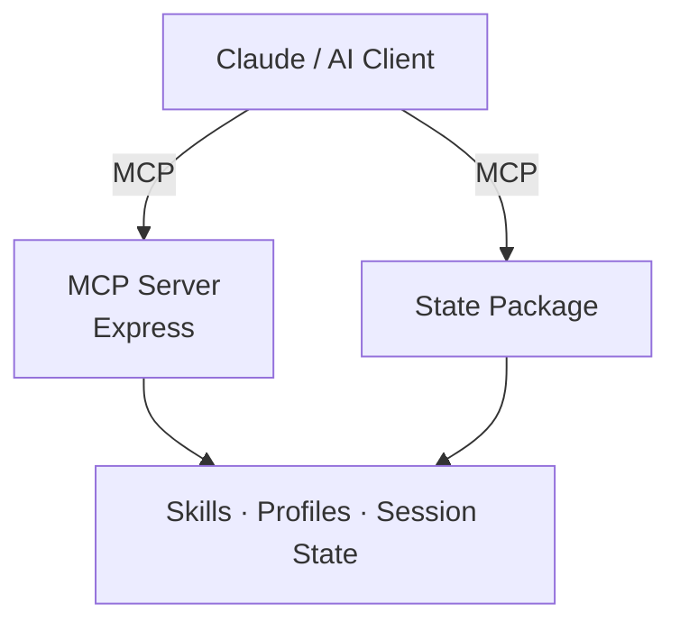

# Joyus AI - Open-Source Multi-Tenant AI Agent Platform

[](LICENSE)

Joyus AI is an open-source platform for deploying AI agents with skills-based mediation, content intelligence, and multi-tenant governance. Founded by [Zivtech](https://zivtech.com).

## Overview

Most AI deployments are undifferentiated: the same model, the same defaults, the same outputs for every user and every organization. Joyus AI inverts that by making organizational knowledge a first-class platform primitive.

**Core ideas:**

- **Skills as encoded knowledge** - organizational standards, voice guidelines, domain rules, and workflow constraints are packaged as skills that constrain and guide AI outputs
- **Content intelligence** - writing profiles built from real corpora enable attribution, fidelity monitoring, and voice-consistent generation
- **Open core, private skills** - the platform is open source; client- and org-specific skills live in private repos and are loaded at runtime
- **MCP-native** - all agent capabilities are exposed via the [Model Context Protocol](https://modelcontextprotocol.io), making them composable with Claude and other MCP-aware tools

## Architecture



- The MCP server is the primary interface between AI clients and platform capabilities.
- The state package maintains session continuity across Claude sessions and compactions.
- The content intelligence system (writing profiles, fidelity verification, drift monitoring) is maintained in a separate private package.
- Skills are modular prompt fragments loaded at runtime; org-specific skills live outside this repo.
- Additional capabilities — including structured knowledge capture, interactive research tooling, and artifact lifecycle management — are under active development in private repositories.

## Packages

### `joyus-ai-mcp-server/` - Remote MCP Server

Express-based MCP server hosting platform tools and operator-defined skills. Connects to external services (issue trackers, version control, messaging) and exposes them as MCP tools.

- TypeScript / Node.js / Express
- Drizzle ORM + PostgreSQL for persistent state
- Deployable via Docker Compose on any cloud VM

### `joyus-ai-state/` - Session State

Maintains working state across Claude sessions. Captures git context, open files, decisions, and test status so Claude can restore context at session start without manual re-orientation.

MCP tools exposed:
- `get_context` - restore working state at session start
- `save_state` - snapshot after significant actions
- `verify_action` - pre-commit guardrails
- `check_canonical` - route to authoritative document copies
- `share_state` - share context with teammates

### `web-chat/` - Chat UI

Minimal browser-based chat interface for local development and demonstration. Not intended for production use.

## Getting Started

**Prerequisites:** Node.js 20+, Docker (optional)

### MCP Server

```bash
cd joyus-ai-mcp-server
npm install
cp .env.example .env   # configure database and service credentials
npm run build
npm start
```

### State Package

```bash
cd joyus-ai-state
npm install
npm run build
# Add joyus-ai-mcp (MCP server binary) to your Claude Desktop / Code MCP config
```

### Full Stack (Docker)

Production deployment configuration is maintained in a separate private repository. For local development, see the per-package instructions above.

## Specs and Development

This project uses [Spec Kitty](https://github.com/Priivacy-ai/spec-kitty) for spec-driven development. Feature specifications live in `kitty-specs/`.

Current status snapshot (canonical source: `status/feature-readiness.json`; generated via `python scripts/generate-status-snippets.py`):

| Spec | Description | Status |
|------|-------------|--------|
| `001` | MCP Server AWS Deployment | Lifecycle: execution, implementation: integrated, readiness: not_ready |
| `002` | Session Context Management | Lifecycle: done, implementation: validated, readiness: pilot_ready |
| `003` | Platform Architecture Overview | Lifecycle: spec-only, implementation: none, readiness: not_ready |
| `004` | Workflow Enforcement | Lifecycle: done, implementation: validated, readiness: pilot_ready |
| `005` | Content Intelligence (Profile Engine) | Lifecycle: done, implementation: validated, readiness: pilot_ready |
| `006` | Content Infrastructure | Lifecycle: done, implementation: integrated, readiness: not_ready |
| `007` | Org-Scale Agentic Governance | Lifecycle: planning, implementation: scaffolded, readiness: not_ready |
| `008` | Profile Isolation and Scale | Lifecycle: execution, implementation: integrated, readiness: not_ready |
| `009` | Automated Pipelines Framework | Lifecycle: execution, implementation: integrated, readiness: not_ready |
| `010` | Multi-Location Operations Module | Lifecycle: planning, implementation: none, readiness: not_ready |
| `011` | Compliance Policy Modules | Lifecycle: planning, implementation: none, readiness: not_ready |

Generated status artifact: `status/generated/feature-table.md`.

Project-level architecture decisions, implementation plan, and constitution are in `spec/`.

## Branch Protection

The default branch (`main`) is protected by a GitHub ruleset that requires pull request reviews from code owners, passing status checks, and prevents force pushes and branch deletion. The ruleset configuration is stored in `.github/ruleset-default.json`.

To apply the ruleset to a new fork or repository:

```bash
gh api repos/OWNER/REPO/rulesets \
  --method POST \
  --input .github/ruleset-default.json
```

Code ownership rules are defined in `.github/CODEOWNERS`.

## Contributing

See [CONTRIBUTING.md](CONTRIBUTING.md) for development setup, branch conventions, and contribution guidelines.

Please read our [Code of Conduct](CODE_OF_CONDUCT.md) before participating.

## License

Apache License 2.0 - see [LICENSE](LICENSE) for details.
