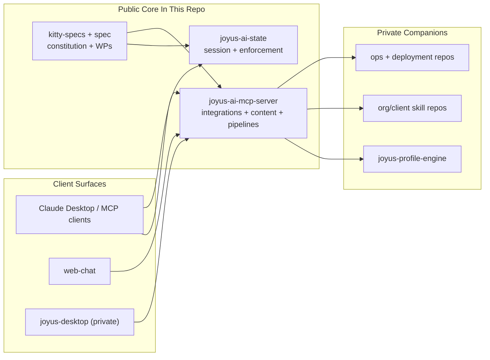

# Joyus AI

[](LICENSE)

Joyus AI is an open-core, multi-tenant AI agent platform for mediated, skills-based AI access. The public repository holds the platform core: MCP services, session/context state, workflow enforcement, content infrastructure, pipeline orchestration, and the specs that govern those systems.

As of April 5, 2026, the repo strategy is:

- keep the public platform core in this repository
- keep organization-specific skills, private corpora, deployment hardening, and private desktop/client surfaces outside this repository
- harden the existing public server and state packages before expanding the next wave of public platform modules

## Public/Private Boundary

| Surface | Visibility | Notes |
| --- | --- | --- |
| [`joyus-ai-mcp-server/`](joyus-ai-mcp-server/README.md) | Public | Remote MCP server, integrations, content infrastructure, pipelines, and Inngest evaluation/migration work |
| [`joyus-ai-state/`](joyus-ai-state/) | Public | Session/context state package plus workflow enforcement companion surface |
| [`web-chat/`](web-chat/) | Public | Thin browser demo UI for local development and demonstrations |
| [`kitty-specs/`](kitty-specs/) + [`spec/`](spec/) | Public | Constitution, feature specs, implementation plans, and public work-package definitions |
| `joyus-profile-engine` | Private companion | Content-intelligence engine implementation stays outside the open-core repo today |
| org/client skill repos | Private companion | Proprietary skills, corpora, brand assets, and org-specific knowledge |
| deployment / ops repos | Private companion | Environment-specific infrastructure, secrets, and hardening |
| [`joyus-desktop`](https://github.com/zivtech/joyus-desktop) | Private companion | Desktop surface related to Joyus; requires repository access |

## Visual Explainer

See the full visual explainer at [`docs/public-platform-visual-explainer.md`](docs/public-platform-visual-explainer.md).



## Current Public Strategy

The public core is not trying to expose every companion system at once. The current public strategy is narrower and matches the code and specs that are actually in this repository:

- `joyus-ai-state` carries the public session/context and workflow-enforcement foundation from Features `002` and `004`.
- `joyus-ai-mcp-server` carries the public server, content infrastructure, and current pipeline runtime from Features `006` and `009`.
- Feature `010` completed the public Inngest spike. Feature `011` is the planned public cleanup/cutover from the custom pipeline runtime to Inngest.
- Feature `007` is the current public governance hardening stream.
- Feature `008` is the public planning stream for tenant-safe profile infrastructure around the private profile engine.
- Feature `005` remains publicly specified but privately implemented. It is intentionally not counted as part of the public-core WP inventory below.

## Roadmap Boundary

These roadmap calls reflect the current public/private split for planning language in this repository.

### Public-leaning roadmap areas

- Platform Framework
- Regulatory Change Detection Pipeline
- Knowledge Base Ingestion
- Code Execution Sandbox
- Plugin compatibility layer
- Compliance Modules
- Compliance framework extensions
- Visual Regression and Accessibility Testing Service

### Private-leaning companion areas

- Asset Sharing Pipeline
- Managed hosting
- Multi-Location Operations Module
- Content Staging and Deployment Pipeline
- Structured knowledge capture and artifact lifecycle management
- AI-assisted research and decision documentation tooling
- Expert Voice Routing
- Self-Service Profile Building
- AI-Assisted Generation
- Profile Engine at Scale
- Attribution Service

## Public Feature Status

Status sources:

- canonical task indexes in `kitty-specs/*/tasks.md`
- lane data from flat `tasks/WP*.md` files where those exist
- `python3 scripts/pride-status.py` run on April 5, 2026

| Feature | Scope | Status | Notes |
| --- | --- | --- | --- |
| `002` Session & Context Management | Public code in `joyus-ai-state/` | Implemented | Uses legacy monolithic `tasks.md` WP tracking rather than flat `tasks/WP*.md` files |
| `003` Platform Architecture Overview | Public architecture planning | Spec-only | Cross-cutting architecture stream with 3 public WPs |
| `004` Workflow Enforcement | Public code in `joyus-ai-state/` | Implemented | Uses legacy monolithic `tasks.md` WP tracking rather than flat `tasks/WP*.md` files |
| `005` Content Intelligence | Public spec, private implementation | Public spec / private companion runtime | Implemented in the private `joyus-profile-engine` companion repo, not counted in the public-core WP list below |
| `006` Content Infrastructure | Public code in `joyus-ai-mcp-server/` | Complete | `12/12` WPs complete |
| `007` Org-Scale Agentic Governance | Public governance/docs stream | Planned | `0/6` WPs complete |
| `008` Profile Isolation and Scale | Public planning stream | Planned | Canonical public plan is the `8`-WP inventory in `tasks.md` |
| `009` Automated Pipelines Framework | Public code in `joyus-ai-mcp-server/` | In progress | `8/10` WPs complete by lane file status |
| `010` Inngest Evaluation Spike | Public spike | Complete | `6/6` WPs complete |
| `011` Inngest Migration | Public migration plan | Planned | `4` WPs defined; implementation not started |
| `012` CMS Enrichment Delivery | Public placeholder | Stub only | Directory exists but is missing spec/meta/checklist artifacts |

## Public Work-Package Inventory

The list below includes the public-core work-package inventory and excludes private companion implementation work.

### Public Core: Implemented or In Progress

- `002 Session & Context Management`: `WP01` Package Setup & Core Types; `WP02` State Store; `WP03` State Collectors; `WP04` Canonical Document Management; `WP05` State Sharing; `WP06` MCP Server + Core Tools; `WP07` MCP Extended Tools; `WP08` Companion Service; `WP09` Integration & Hardening.
- `004 Workflow Enforcement`: `WP01` Foundation -- Types, Schemas, Config & Kill Switch; `WP02` Audit Trail Infrastructure; `WP03` Quality Gate Engine; `WP04` Skill Enforcement Engine; `WP05` Git Guardrails Engine; `WP06` MCP Tools -- Gates, Branch & Status; `WP07` MCP Tools -- Skills, Upstream, Audit & Corrections; `WP08` Companion Service Extensions; `WP09` Integration Testing & Hardening.
- `006 Content Infrastructure`: `WP01` Content Schema & Foundation; `WP02` Connector Abstraction & MVP Connectors; `WP03` Sync Engine; `WP04` Search Abstraction & PostgreSQL FTS; `WP05` Entitlement Resolution; `WP06` Content-Aware Generation; `WP07` MCP Content Tools; `WP08` Mediation API Auth & Sessions; `WP09` Mediation API Endpoints; `WP10` Voice Drift Monitoring; `WP11` Observability; `WP12` Integration Tests & Server Wiring.
- `009 Automated Pipelines Framework`: `WP01` Schema & Foundation; `WP02` Event Bus; `WP03` Trigger System; `WP04` Pipeline Executor; `WP05` Built-in Step Handlers; `WP06` Review Gates; `WP07` Schedule Triggers & Templates; `WP08` Pipeline API & MCP Tools; `WP09` Analytics & Quality Signals; `WP10` Integration & Validation.
- `010 Inngest Evaluation Spike`: `WP01` Local Inngest Server Setup; `WP02` Port One Pipeline to Inngest Functions; `WP03` Review Gate via `step.waitForEvent()`; `WP04` Per-Tenant Concurrency and Cron Scheduling; `WP05` Performance Comparison; `WP06` Decision Document and Migration Plan.

### Public Planning and Governance Streams

- `003 Platform Architecture Overview`: `WP01` Domain Decomposition; `WP02` Governance Alignment; `WP03` Integration Risk Review.
- `007 Org-Scale Agentic Governance`: `WP01` Baseline and Scoring; `WP02` Backlog and Ownership; `WP03` Governance Remediations; `WP04` Workflow and Metadata Contracts; `WP05` Automated Checks and CI; `WP06` Autonomy Leveling and Scenario Policy.
- `008 Profile Isolation and Scale` (canonical public plan): `WP01` Schema & Foundation; `WP02` Profile Generation Pipeline; `WP03` Profile Versioning; `WP04` Composite Profile Inheritance; `WP05` Self-Service Corpus Intake; `WP06` Resolved Profile Caching; `WP07` MCP Tools & Integration; `WP08` Performance Validation.
- `011 Inngest Migration`: `WP01` Port Remaining Pipeline Functions; `WP02` Update Routes to `inngest.send()`; `WP03` Delete Custom Execution Plumbing; `WP04` Integration Tests and Acceptance.

### Public Specs With Private Companion Implementations

- `005 Content Intelligence` is intentionally omitted from the public-core WP inventory above because the implementation target is the private `joyus-profile-engine` companion repo even though the specification remains public.

## Repository Map

- [`joyus-ai-mcp-server/`](joyus-ai-mcp-server/README.md): public remote MCP server, integrations, content APIs, and pipeline runtime work
- [`joyus-ai-state/`](joyus-ai-state/): public state and workflow-enforcement package
- [`web-chat/`](web-chat/): thin public browser demo
- [`kitty-specs/`](kitty-specs/): public feature specs and work-package decomposition
- [`spec/`](spec/): constitution, governance, and cross-feature planning docs
- [`deploy/claude-desktop-config.md`](deploy/claude-desktop-config.md): Claude Desktop connector setup

## Getting Started

### MCP Server

See [`joyus-ai-mcp-server/README.md`](joyus-ai-mcp-server/README.md).

### State / Enforcement Package

```bash
cd joyus-ai-state
npm install
npm run build
```

Then add `joyus-ai-mcp` to your Claude Desktop or Code MCP configuration. See [`deploy/claude-desktop-config.md`](deploy/claude-desktop-config.md).

### Web Chat Demo

```bash
cd web-chat
python3 -m http.server 8000
```

## Contributing

See [CONTRIBUTING.md](CONTRIBUTING.md) for setup, branching, and contribution guidelines.

Please read our [Code of Conduct](CODE_OF_CONDUCT.md) before participating.

## License

Apache License 2.0 - see [LICENSE](LICENSE) for details.
