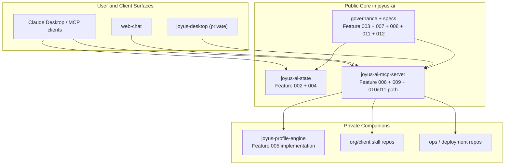
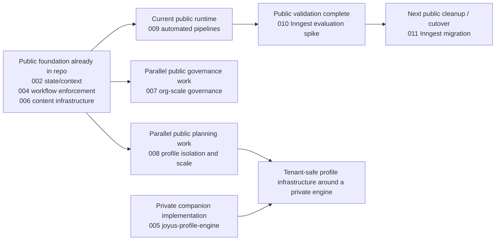

# Joyus AI Public Platform Visual Explainer

This explainer shows the public-core boundary and the strategy the repository is currently following as of April 5, 2026.

## 1. Public Core vs Private Companions

## 2. Strategy Sequencing

## 3. Reading the Boundary Correctly

- Public here means platform core, governance artifacts, and work-package definitions live in this repository.
- Private here means proprietary skills, real corpora, deployment hardening, and the current profile-engine implementation stay outside this repository.
- Feature `005` is public as a specification and private as an implementation surface.
- Features `007`, `008`, and `011` are the next public planning/governance streams already visible in this repository.

## 4. Future Lanes

### Public-leaning roadmap lanes

- Platform Framework
- Regulatory Change Detection Pipeline
- Knowledge Base Ingestion
- Code Execution Sandbox
- Plugin compatibility layer
- Compliance Modules
- Compliance framework extensions
- Visual Regression and Accessibility Testing Service

### Private-leaning companion lanes

- Asset Sharing Pipeline
- Managed hosting
- Multi-Location Operations Module
- Content Staging and Deployment Pipeline
- Structured knowledge capture and artifact lifecycle management
- AI-assisted research and decision documentation tooling
- Expert Voice Routing
- Self-Service Profile Building
- AI-Assisted Generation
- Profile Engine at Scale
- Attribution Service
